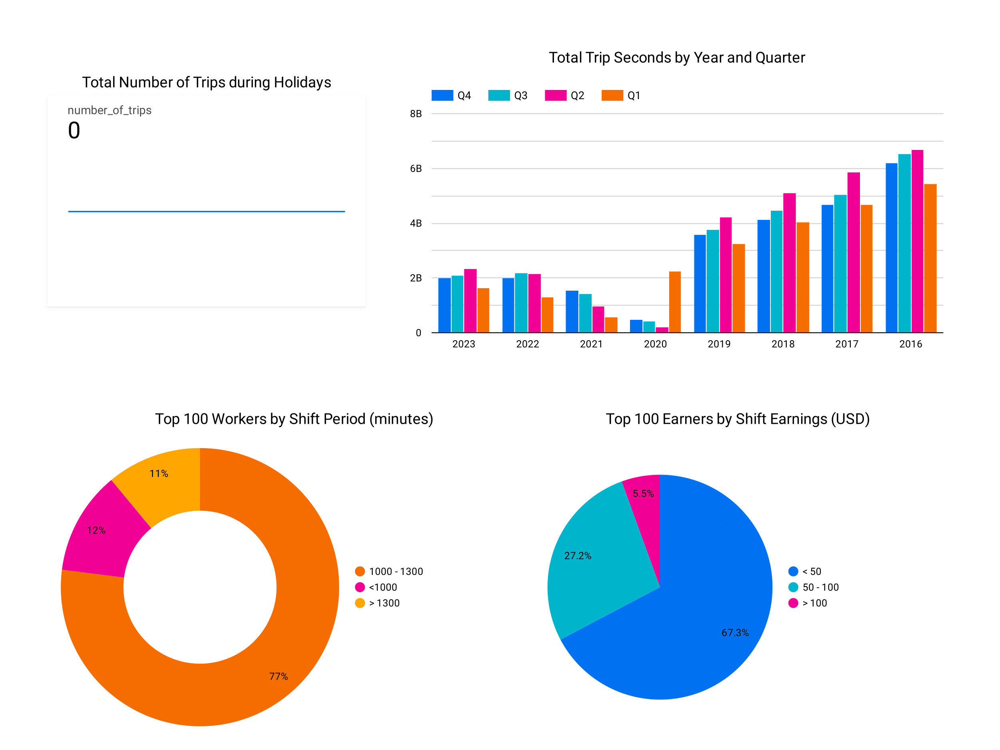

<a name="readme-top"></a>

<details>
  <summary>Table of Contents</summary>
  <ol>
    <li>
      <a href="#getting-started">Getting Started</a>
      <ul>
        <li><a href="#prerequisites">Prerequisites</a></li>
        <li><a href="#installation">Installation</a></li>
      </ul>
    </li>
    <li><a href="#usage">Usage</a></li>
    <li><a href="#output">Usage</a></li>
  </ol>
</details>


<!-- GETTING STARTED -->
## Getting Started

Currently, the setup can only be done in a single machine.

### Prerequisites

You will need a Google Cloud Platform account in order to setup BigQuery and the credentials in order for it to work
* [Google Cloud Platform][gcp-url]
* [Application Authentication][appauth-url]

You will need python libraries and dependency manager such as *pip*. I use *poetry*
* [Poetry][poetry-url]

    ```console
    $ curl -sSL https://raw.githubusercontent.com/python-poetry/poetry/master/get-poetry.py | python -
    ```

### Installation
1. Clone the repo

    ```console
    $ git clone https://github.com/koksang/test.git
    ```

2. To install dependencies, you can

    * poetry
        ```console
        $ poetry install
        $ poetry shell
        ```

<p align="right">(<a href="#readme-top">back to top</a>)</p>

<!-- USAGE EXAMPLES -->
## Usage

1. Setup environment
    * Use _.env_
        ```console
        $ touch .env
        $ echo "AIRFLOW_HOME=${YOUR PATH TO AIRFLOW_HOME}" >> .env
        $ echo "DBT_PROJECT_DIR=${YOUR DBT_PROJECT_DIR}" >> .env
        $ echo "DBT_PROFILES_DIR=${YOUR DBT_PROFILES_DIR}" >> .env
        $ echo "PROJECT_ID=${YOUR GCP PROJECT_ID}" >> .env
        $ echo "BUCKET=${YOUR GCS BUCKET}" >> .env
        $ set -a && source .env
        ```

2. Start a local airflow cluster
    * Create airflow database

        ```console
        $ airflow db init
        $ airflow users create -u admin -r Admin --password admin -e admin -f admin -l admin
        ```

    * Start airflow webserver

        ```console
        $ airflow webserver
        ```
    
    * Start airflow scheduler

        ```console
        $ airflow scheduler
        ```

    * Go to airflow and login using username: `admin` and password: `admin`

3. To exit poetry shell, you can

    * poetry
        ```console
        $ exit
        ```

<p align="right">(<a href="#readme-top">back to top</a>)</p>

## Output



<p align="right">(<a href="#readme-top">back to top</a>)</p>

<!-- setup -->
[gcp-url]: https://cloud.google.com
[appauth-url]: https://cloud.google.com/docs/authentication/getting-started#setting_the_environment_variable
[poetry-url]: https://python-poetry.org/docs/#installation

<!-- results -->
[dashboard-url]: insights_report.png